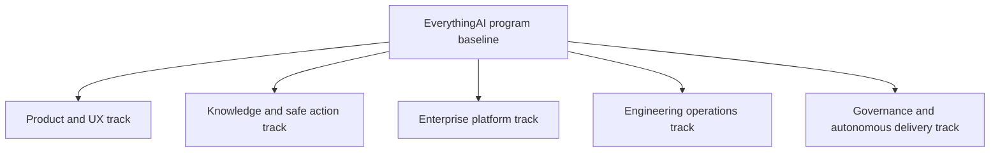

# EverythingAI — Phase 0 Reconciliation Baseline

**Prepared:** 2026-08-14  
**CEO approval:** 2026-08-16  
**Repository:** `moh0709/everythingAI`  
**Default branch:** `main`  
**Product Owner / CEO:** Mohammad Ismail  
**Lead Architect / CTO / PM / QA:** ChatGPT  
**Status:** CEO-approved operating baseline  

---

## 1. Purpose and authority

This document establishes one plain-language baseline for deciding what EverythingAI is, what is actually implemented, what is operationally proven, what remains incomplete, which risks matter most, and what should be prioritized next.

It reconciles the repository’s canonical state files, roadmaps, architecture documents, recent handovers, live issue inventory, and recent commit history. It does not treat a handover, implementation claim, open issue, or roadmap checkbox as accepted merely because it exists.

For conflict resolution, the existing project authority hierarchy remains valid:

1. Explicit CEO decisions.
2. Accepted PM decisions and GitHub acceptance comments.
3. `PROJECT_STATE.md`.
4. `AI_BOOTSTRAP.md`.
5. Accepted architecture, ADRs, runbooks, and issue bodies.
6. Accepted handovers, reports, logs, commits, and runtime evidence.
7. Unaccepted implementation artifacts and agent statements.

This baseline adds one governing rule:

> No new feature or implementation track should be released unless it maps to an approved baseline track, dependency, acceptance gate, and measurable outcome.

---

## 2. Executive verdict

EverythingAI is not an early prototype. It is a broad, validated local-first product foundation with source-backed knowledge, governed planning and execution, recovery controls, administrative AI configuration, agent connectors, and a substantial automated engineering-governance system.

The primary problem is no longer lack of capability. The primary problem is that implementation, governance closure, roadmap language, phase numbering, deployment work, and autonomous-agent operations have advanced on partially separate timelines.

This has created five forms of drift:

- `PROJECT_STATE.md` describes Phase 3 as blocked at the Linux systemd deployment gate.
- `ROADMAP.md` and `IMPLEMENTATION_ROADMAP.md` still describe Phase 8.3 as the next recommended phase from a June baseline.
- August handovers document implementation work for Phase 5 governance issues #6–#13.
- Forge operational work advanced through issues #101–#105, with issue #105 truthfully blocked at its final scheduler soak gate.
- Historical documents still describe conditions that have since been superseded, including an early-prototype/in-memory architecture and missing Windows Forge prerequisites.

The correct conclusion is not that one of these sources is entirely wrong. They describe different tracks but use overlapping phase language without a single program map.

### Current maturity assessment

The following values are decision estimates, not automated measurements:

| Dimension | Estimated maturity | Assessment |
|---|---:|---|
| Product concept and differentiation | 90% | Clear and strategically coherent |
| Local MVP feature foundation | 85–90% | Broad, integrated, and repeatedly validated |
| Knowledge and evidence experience | 80–85% | Strong foundation; citation and formatting polish remain |
| Safe planning, execution, undo, and audit | 85–90% | Strong local model; broader production controls remain |
| Engineering tests and repository evidence | 80–90% | Latest operational handover reports 190/190 tests passing |
| Governance implementation | 75–85% | Many controls implemented; acceptance and closure are behind |
| Governance-state reconciliation | 40–50% | Canonical files and live issue state are not synchronized |
| Autonomous delivery reliability | 50–60% | Core Forge path works; clean post-fix scheduler cycle remains unproven |
| Enterprise production readiness | 30–40% | Auth, tenancy, deployment, observability, and production data architecture remain |
| Overall program readiness | 60–65% | Strong product foundation constrained by state drift and operational gates |

The earlier 60–70% assessment remains directionally reasonable. The important refinement is that the missing 35–40% is not mainly additional features. It is reconciliation, acceptance, operational proof, product release discipline, and production foundations.

---

## 3. One unified program model

EverythingAI should stop using one phase number to describe the entire program. The program should be managed through five explicit tracks.



| Track | Current truth | Next gate |
|---|---|---|
| Product and UX | Local Client Workspace and Admin Dashboard are implemented and validated | Freeze a release-candidate scope and complete real product QA |
| Knowledge and safe action | Source-backed Knowledge Base, planning, preview, approval, execution, undo, and audit foundations exist | Improve evidence UX and validate end-to-end user workflows |
| Enterprise platform | Target architecture is documented; production platform is not complete | CEO must approve when to begin auth, tenant, device, database, and deployment foundations |
| Engineering operations | Repository reliability foundation exists; Linux systemd deployment gate remains unresolved in canonical state | Resolve or formally supersede #68/#76 and define the authoritative runtime target |
| Governance and autonomous delivery | Phase 5 governance artifacts and Forge execution foundations exist | Reconcile open work, complete PM acceptance, and prove one clean autonomous cycle |

This model preserves all valuable work without forcing unrelated activities into one misleading phase sequence.

---

## 4. What is implemented and healthy

### 4.1 Product foundation

The repository documents and handovers support the following implemented foundation:

- Local folder scanning and source-path management.
- File metadata registration, hashing, status tracking, and change detection foundations.
- Text extraction for supported document types.
- Local search and semantic-style search.
- Source-backed Knowledge Base / Wiki pages.
- Source rails, chunks, citation diagnostics, and evidence inspection.
- Knowledge quality scoring, human validation, conflict detection, and review candidates.
- Client Workspace separated from the Admin Dashboard.
- Admin-selected AI providers with backend authority over provider choice.
- Organization suggestions and planning sessions.
- Dry-run previews, approval-gated execution, execution batches, recovery snapshots, undo, trash, restore, and audit.
- Watcher and long-running job foundations.
- Admin-only Agent Connector catalog, detection, and controlled version probes.
- Backend tests, frontend typecheck/build, and CI smoke-test foundations.

### 4.2 Safety model

The safety philosophy is one of the project’s strongest assets:

- Client Workspace does not expose agent-connector administration.
- Browser users cannot submit arbitrary shell commands.
- Permanent purge is blocked in the MVP.
- Move and rename actions require preview and approval.
- Recovery and audit evidence are part of the action model.
- AI-generated knowledge is connected to evidence and validation state.
- Future AI Organization Workspace work is explicitly copy-first, fail-closed, and stage-gated.
- Phase 5 governance documents require explainability, observability, rollback, and controlled activation before hard enforcement.

### 4.3 Engineering and governance discipline

The repository has unusually strong evidence discipline for a project at this maturity:

- Canonical startup files exist.
- Tasks are dependency-gated.
- Completion is separated from PM acceptance.
- PASS requires reviewable evidence.
- BLOCKED is treated as a valid truthful outcome.
- Handover JSON, reports, logs, state files, issue labels, comments, commits, and runtime behavior are expected to agree.
- Recent Forge work added centralized eligibility, duplicate-claim protection, explicit failure telemetry, and bounded execution.
- The latest operational handover reports `framework-doctor` PASS and 190/190 tests PASS.

---

## 5. What is incomplete, contradictory, or unproven

### 5.1 Canonical project state is stale

`PROJECT_STATE.md` still says:

- Phase 2 complete.
- Phase 3 in progress.
- Current gate blocked at issues #68/#76.
- Direct Linux SSH/systemd provisioning is the immediate next action.

This may still be a valid unresolved deployment track, but it does not describe the full August program state. It omits later Forge operations, Phase 5 governance work, issue #21’s product-design contract, and the open-issue reconciliation activity.

### 5.2 Roadmaps are historically useful but no longer operationally current

`ROADMAP.md` and `IMPLEMENTATION_ROADMAP.md` accurately describe the validated local MVP and enterprise direction, but their immediate priorities are anchored to the June 13 Phase 8.2 baseline. They should no longer be used alone to release new work.

### 5.3 Phase numbering collides

The repository uses at least three phase vocabularies:

- Product/local MVP phases and Phase 8.x release hardening.
- Hermes engineering-reliability Phase 2/3 work.
- Enterprise governance Phase 5.1–5.8.

Without track prefixes, statements such as “Phase 3 in progress” and “Phase 5 complete” appear contradictory even when both are true within separate tracks.

### 5.4 Implemented work is not the same as accepted work

August handovers exist for Phase 5 issues #6–#13. The live open-issue inventory still includes these issues. Under the project’s own rules, the safest classification is:

```text
implementation evidence exists
PM acceptance/closure is not yet reconciled
therefore the work is not yet an accepted program baseline
```

### 5.5 Forge is not yet proven stable enough for unattended trust

The latest handover for issue #105 records:

- Forge claimed the issue.
- Codex launched with no recorded spawn error.
- Framework doctor passed.
- 190/190 tests passed.
- No duplicate #105 claim was observed in the documented cycle.
- The scheduler result was observed while the parent task was still running.
- A clean unchanged post-exit scheduler cycle with `LastTaskResult = 0` was still required.

The correct status is therefore BLOCKED at the final operational soak gate, not failed and not accepted.

### 5.6 Two automation/runtime stories coexist

The canonical state describes Hermes on a Linux VPS and a target systemd deployment. The Forge architecture describes automatic Codex CLI execution on a Windows desktop host. Both may be useful, but ownership boundaries are not yet represented in one accepted operating model.

The project must avoid two systems independently believing they are the claim authority for the same queue.

### 5.7 Enterprise architecture is a target, not the current runtime

Documents describe future PostgreSQL, Qdrant, object storage, queues, tenancy, authentication, gateway, and observability services. These are strategic targets. They must not be presented as already implemented in the local MVP.

### 5.8 Historical assessments need status labels

`PROJECT_ASSESSMENT_MUST_HAVE_IMPROVEMENTS.md` describes an early prototype with in-memory storage and recommends delaying AI features. That document was appropriate when written, but current repository documents describe SQLite persistence, a validated local MVP, and extensive knowledge functionality. It should be marked historical/superseded rather than silently left as a current assessment.

---

## 6. Architecture baseline

### 6.1 Current implemented architecture

```text
Local source folders
  -> scanner / watcher
  -> metadata registry and extraction
  -> local search and source-backed knowledge
  -> Client Workspace
  -> Admin Dashboard
  -> planning and preview
  -> approval-gated local action execution
  -> recovery / undo / audit
```

Supporting layers include:

- React/TypeScript user and admin interfaces under `apps/everything-ai-ui`.
- Node-based API and local services under `services/api`.
- Local persistence and repositories for files, jobs, knowledge, diagnostics, planning, and execution evidence.
- Optional AI provider and agent-connector bridges controlled from Admin.
- GitHub issue-based delivery governance.
- Hermes and Forge operational automation components.

### 6.2 Operational candidate architecture

```text
CEO
  -> ChatGPT as CTO / PM / QA
  -> one accepted issue release
  -> one authoritative eligibility and claim path
  -> Forge execution worker
  -> evidence submission
  -> independent PM review
  -> acceptance or correction
```

Recommended ownership:

| Role | Authority |
|---|---|
| CEO | Product and business decisions; final consequential approval |
| ChatGPT | Architecture, roadmap, issue release, acceptance matrix, PM review, QA, recommendation |
| Forge | Narrow coding execution on released issues; never self-accepts |
| Hermes | Infrastructure/operational work only where explicitly assigned, or retired from overlapping code-claim duties |
| Human operator | Direct root/SSH/privileged host operations following an accepted runbook |

### 6.3 Future enterprise architecture

The documented enterprise target remains useful:

- Auth and tenant/workspace isolation.
- Stable user/device identity.
- PostgreSQL-backed canonical data.
- Object storage where archive mode requires it.
- Background jobs and durable queueing.
- Production observability.
- Central server plus installed local client agents.
- Governance-filtered retrieval and policy-controlled execution.

This target should be implemented incrementally after the local release baseline and operating model are stable.

---

## 7. Risk register

| ID | Risk | Severity | Current state | Required control |
|---|---|---:|---|---|
| R1 | Canonical state and live repository state diverge | Critical | Open | Update one authoritative program baseline and require roadmap mapping |
| R2 | Different tracks use conflicting phase numbers | High | Open | Prefix every phase with a track name; stop using bare phase numbers |
| R3 | Completed/review work remains open and unaccepted | Critical | Open | PM review queue with evidence-backed close, verify, block, future, duplicate classifications |
| R4 | Forge unattended operation is accepted before clean soak evidence | Critical | Blocked correctly | Require unchanged post-exit cycle, scheduler result 0, idempotency, and no duplicate claim |
| R5 | Hermes and Forge overlap as claim/execution authorities | Critical | Architecture ambiguity | Define one queue authority and mutually exclusive task ownership |
| R6 | Linux deployment gate #68/#76 remains unresolved or silently abandoned | High | Open in canonical state | Complete it, formally supersede it, or move it to an explicit future track by CEO/PM decision |
| R7 | New feature expansion increases breadth before release discipline is complete | High | Active pressure | Temporary feature freeze and release-candidate scope |
| R8 | Production architecture is mistaken for implemented capability | High | Documentation ambiguity | Label every architecture section as current, candidate, or future |
| R9 | Privileged execution or secrets leak through automation | Critical | Controlled, continuously relevant | Least privilege, sanitized evidence, external secret files, human approval for privileged operations |
| R10 | Hard governance enforcement activates before shadow maturity and rollback proof | Critical | Phase 5 controls documented | No hard enforcement without accepted shadow evidence, explainability, rollback, and certification |
| R11 | Historical docs continue to direct current work | Medium | Open | Add superseded/historical headers and link to the current baseline |
| R12 | Product claims exceed real user QA | High | Open | Disposable-folder tests, full workflow smoke, manual UX QA, known-limitations register |

---

## 8. Evidence-based priority order

### Priority 1 — Approve the unified program-track model

**Why first:** Every later decision depends on knowing which roadmap and gate a task belongs to.

**Required outcome:** Adopt the five-track model in Section 3 and prohibit unqualified phase labels.

### Priority 2 — Complete the open-issue PM reconciliation

**Why:** Issue #103 and commits `0ab4aa6`, `8cab443`, and `1816018` show that reconciliation artifacts exist and were corrected, but the project still has many open issues with implementation or review history.

**Required outcome:** Every open issue appears exactly once in one of these groups:

- ready for PM close;
- needs PM verification;
- legitimately blocked;
- future/unreleased;
- stale/duplicate.

No bulk closure should occur without evidence review.

### Priority 3 — Close the Forge operational proof gap

**Why:** Autonomous execution is high leverage but becomes a systemic risk if accepted prematurely.

**Required outcome:** Complete issue #105’s clean unchanged scheduler cycle, verify result 0, prove no duplicate claim, confirm label integrity, and then perform PM acceptance.

### Priority 4 — Decide the authoritative execution topology

**Why:** Hermes/Linux and Forge/Windows currently tell two partially overlapping operational stories.

**Recommendation:** Use ChatGPT as the only PM/release authority, Forge as the primary code execution worker, and a human-controlled infrastructure path for privileged host work. Hermes should receive only explicitly non-overlapping operational tasks unless the CEO decides to retain it as a separate infrastructure executor.

### Priority 5 — Update canonical state and roadmap documents

**Why:** `PROJECT_STATE.md`, `ROADMAP.md`, and `IMPLEMENTATION_ROADMAP.md` must agree with accepted issue state and the chosen execution topology.

**Required outcome:** One current-state record, track-specific roadmap status, accepted evidence SHAs, unresolved gates, and exact next task.

### Priority 6 — Establish a release-candidate baseline

**Why:** The local MVP is feature-rich enough to validate as a product. More features will not answer whether ordinary users can trust and understand it.

**Required outcome:** Pin the current commit, dependency versions, test counts, typecheck/build, smoke paths, supported file types, security boundaries, and known limitations.

### Priority 7 — Run end-to-end product QA

Validate the ordinary user path:

```text
select a disposable folder
-> scan and extract
-> inspect files and progress
-> search and open knowledge
-> verify citations
-> generate an organization plan
-> preview and approve
-> execute a safe action
-> undo and inspect audit evidence
```

### Priority 8 — Resolve the Linux deployment track

CEO/PM must choose one:

1. Complete #68/#76 through direct authorized host provisioning.
2. Formally supersede the systemd path with the accepted Windows/Forge operating model.
3. Retain Linux systemd as a future production-infrastructure track with no claim that it is the current dependency gate.

**Recommendation:** Option 3 unless the Linux Hermes runtime is required for the next product milestone.

### Priority 9 — Select one post-baseline product track

After reconciliation and release QA, choose only one major product direction:

- Local MVP release and pilot hardening — **recommended first**.
- AI Organization Workspace Stage 2 archive-profile foundation.
- Enterprise auth/tenant/device/persistence foundation.

Do not run all three as equal priorities.

### Priority 10 — Resume controlled feature expansion

Only after Priorities 1–9 have explicit outcomes should the project resume optional connector expansion, advanced document extraction, full archive execution, or hard governance enforcement.

---

## 9. What we will not do

Until this baseline is approved and the first five priorities are complete:

- We will not start a broad new product feature.
- We will not treat a handover as PM acceptance.
- We will not close issues merely to reduce the issue count.
- We will not release two dependency-conflicting execution tasks.
- We will not let Hermes and Forge independently claim from the same authority path.
- We will not accept unattended Forge operation without the clean soak result.
- We will not activate hard policy enforcement without accepted shadow-mode maturity and rollback proof.
- We will not perform a broad architecture rewrite from the local MVP to the enterprise target.
- We will not enable full-drive unattended organization or overwrite behavior by default.
- We will not present future PostgreSQL, tenant, queue, object-storage, or observability architecture as already implemented.
- We will not use stale roadmap dates as the sole basis for current release decisions.
- We will not expand AnythingLLM, OpenDataLoader, or additional agent connectors unless they solve a measured product gap.

---

## 10. Recommended 90-day roadmap

### Days 0–7 — Reconciliation and control

- Approve this baseline or record CEO corrections.
- Finish issue #103 evidence review and build the PM closure queue.
- Finish issue #105 operational soak evidence.
- Decide Hermes/Forge/human operator boundaries.
- Update `PROJECT_STATE.md` and roadmap status.
- Declare a temporary feature freeze.

**Exit gate:** One accepted program state, one execution authority, one next task.

### Days 8–30 — Local MVP release candidate

- Pin a release-candidate commit.
- Run full backend, frontend, framework, and UI smoke validation.
- Execute disposable-folder product QA.
- Reconcile supported/unsupported file behavior.
- Improve only release-blocking progress, citation, API-key, recovery, and error UX.
- Produce a known-limitations and operator runbook.

**Exit gate:** A reproducible local release candidate that can be demonstrated and tested safely.

### Days 31–60 — Pilot readiness

- Package onboarding and setup for selected pilot users.
- Add product telemetry that respects local-first privacy.
- Define pilot success metrics.
- Fix only evidence-backed pilot blockers.
- Decide the target deployment and update mechanism.

**Exit gate:** Controlled pilot approval.

### Days 61–90 — One strategic expansion

Choose one:

- AI Organization Workspace Stage 2–3: archive profile plus preview-only planner; or
- Enterprise foundation: auth, tenant/workspace, stable device identity, and persistent central data model.

**Recommendation:** Choose the archive profile plus preview-only planner if near-term value is a compelling local product. Choose enterprise foundations if near-term value is multi-user/company deployment. Do not implement copy execution or hard enterprise migration in the same first increment.

---

## 11. CEO decision points

| Decision | Recommendation | Consequence |
|---|---|---|
| Adopt five program tracks | Approve | Removes phase conflict without discarding history |
| Temporary feature freeze | Approve through Priority 5 | Concentrates work on truth, acceptance, and stability |
| Primary code executor | Forge, after #105 acceptance | One accountable automated implementation path |
| Hermes role | Infrastructure-only or explicitly isolated | Prevents overlapping claim authority |
| Linux #68/#76 | Move to explicit infrastructure track unless immediately required | Stops an old gate from blocking unrelated product progress |
| Next product milestone | Local MVP release candidate | Converts broad capability into a testable product |
| Post-RC strategic track | Decide after pilot objective is clear | Avoids simultaneous archive and enterprise rewrites |

---

## 12. Proposed authoritative status after approval

```text
EverythingAI is a validated local-first, source-backed AI knowledge and safe-action workspace.

Its local product foundation is advanced, while enterprise production readiness remains incomplete.

The immediate program phase is Reconciliation and Release Control.

No new major feature is released until:
1. open issue state is reconciled;
2. Forge completes its clean operational soak gate;
3. execution ownership is explicit;
4. canonical state and roadmaps are synchronized; and
5. a local MVP release-candidate baseline is defined.
```

---

## 13. Source and conflict map

| Source | What it reliably establishes | Current limitation |
|---|---|---|
| `PROJECT_STATE.md` | Authority, Phase 3 reliability baseline, #68/#76 deployment gate, governance rules | Does not include later August program work |
| `AI_BOOTSTRAP.md` | Roles, lifecycle, evidence requirements, queue and acceptance rules | Operating contract; not a live status report |
| `docs/ROADMAP.md` | Validated local MVP capability map and production-readiness estimate | Immediate priorities anchored to June 13 |
| `docs/IMPLEMENTATION_ROADMAP.md` | Product/enterprise build sequence and safety invariants | Immediate priorities anchored to Phase 8.3 history |
| `docs/ENTERPRISE_TECHNICAL_ARCHITECTURE.md` | Strategic production architecture | Target architecture, not current implementation |
| `docs/AI_ORGANIZATION_WORKSPACE_DESIGN.md` | Approved design contract and stage gates for future archive work | Runtime archive execution is not accepted |
| `docs/FORGE_AUTONOMOUS_EXECUTION_ARCHITECTURE.md` | Intended Forge claim, execution, timeout, and completion flow | Some prerequisite statements are superseded by later operational evidence |
| Phase 5 handovers dated 2026-08-01 | Implementation evidence exists for governance issues #6–#13 | Open issues and PM acceptance still require reconciliation |
| `HANDOVER_2026-08-06_ISSUE_105_FORGE_AUTONOMOUS_CYCLE.json` | Latest explicit operational status, tests, blocker, safe next action | Final post-exit scheduler proof still missing |
| Recent commits through `1816018` | Reconciliation, Forge launch fix, issue #105 blocker, and evidence correction reached `main` | Commit existence does not equal PM acceptance |

---

## 14. CEO approval record and authorized next actions

On 2026-08-16, the CEO approved proceeding on this baseline. The following recommendations are therefore adopted as the operating direction:

1. The five-track program model is approved.
2. The evidence-based priority order is approved.
3. The temporary major-feature freeze remains active through Priority 5.
4. Forge becomes the recommended primary code execution worker after issue #105 passes independent PM review.
5. Hermes is limited to explicitly assigned, non-overlapping infrastructure or operational work unless the CEO later changes its role.
6. The Linux systemd work is managed as an explicit infrastructure track and does not silently block unrelated product work unless it is required by the selected milestone.
7. The local MVP release candidate is the next product milestone.
8. Canonical repository documents are authorized for controlled, evidence-backed synchronization with this baseline.
9. Protected issue #69 remains unchanged unless the CEO explicitly changes that rule.

Execution must continue through the existing authority hierarchy, dependency gates, independent PM review, and evidence requirements. This approval does not convert unaccepted implementation claims into accepted work and does not authorize destructive, privileged, or secret-exposing actions.
